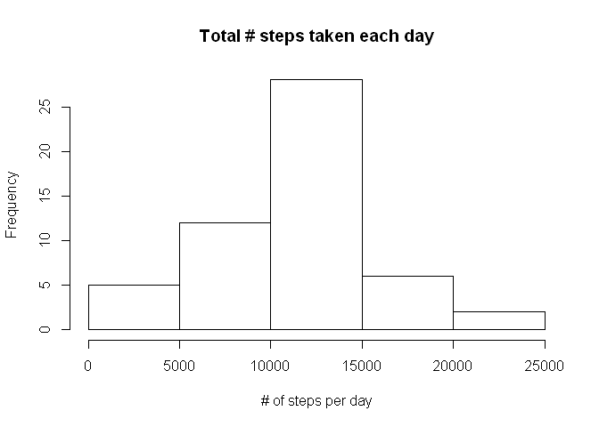
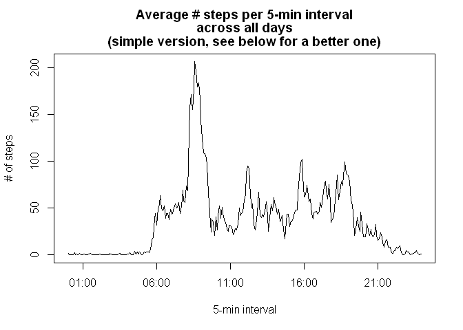
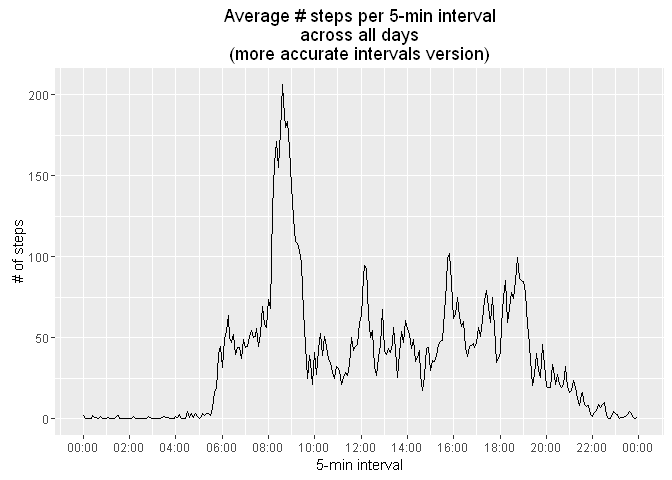
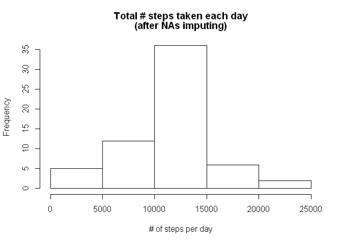
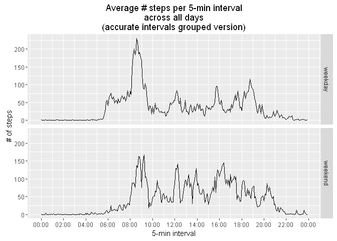

# Reproducible Research: Peer Assessment 1

by Yiannis Manatos, © Feb. 2016


## R libraries initialization


```r
# R libraries initialization
library(scales)
library(ggplot2)
```

```
## Warning: package 'ggplot2' was built under R version 3.2.3
```

```r
library(dplyr)
```

```
## Warning: package 'dplyr' was built under R version 3.2.3
```

```
## 
## Attaching package: 'dplyr'
```

```
## The following objects are masked from 'package:stats':
## 
##     filter, lag
```

```
## The following objects are masked from 'package:base':
## 
##     intersect, setdiff, setequal, union
```

```r
tz <- Sys.getenv("TZ")
Sys.setenv(TZ = "GMT")
```


## I) Loading and preprocessing the data


```r
# Read data from file
all_data <- read.csv("activity.csv", header = TRUE)
str(all_data)
```

```
## 'data.frame':	17568 obs. of  3 variables:
##  $ steps   : int  NA NA NA NA NA NA NA NA NA NA ...
##  $ date    : Factor w/ 61 levels "2012-10-01","2012-10-02",..: 1 1 1 1 1 1 1 1 1 1 ...
##  $ interval: int  0 5 10 15 20 25 30 35 40 45 ...
```

```r
# Add 'Date' column, from 'date'
all_data$Date <- as.Date(all_data$date, 
                         tz = "GMT")
# Add 'Interval' column, from 'interval'
all_data$Interval <- as.POSIXct(paste("2016-01-01", sprintf("%04d", all_data$interval)), 
                            tz = "GMT", 
                            format = "%Y-%m-%d %H%M")

# Examine all data read
str(all_data)
```

```
## 'data.frame':	17568 obs. of  5 variables:
##  $ steps   : int  NA NA NA NA NA NA NA NA NA NA ...
##  $ date    : Factor w/ 61 levels "2012-10-01","2012-10-02",..: 1 1 1 1 1 1 1 1 1 1 ...
##  $ interval: int  0 5 10 15 20 25 30 35 40 45 ...
##  $ Date    : Date, format: "2012-10-01" "2012-10-01" ...
##  $ Interval: POSIXct, format: "2016-01-01 00:00:00" "2016-01-01 00:05:00" ...
```

```r
head(all_data)
```

```
##   steps       date interval       Date            Interval
## 1    NA 2012-10-01        0 2012-10-01 2016-01-01 00:00:00
## 2    NA 2012-10-01        5 2012-10-01 2016-01-01 00:05:00
## 3    NA 2012-10-01       10 2012-10-01 2016-01-01 00:10:00
## 4    NA 2012-10-01       15 2012-10-01 2016-01-01 00:15:00
## 5    NA 2012-10-01       20 2012-10-01 2016-01-01 00:20:00
## 6    NA 2012-10-01       25 2012-10-01 2016-01-01 00:25:00
```

```r
summary(all_data)
```

```
##      steps                date          interval           Date           
##  Min.   :  0.00   2012-10-01:  288   Min.   :   0.0   Min.   :2012-10-01  
##  1st Qu.:  0.00   2012-10-02:  288   1st Qu.: 588.8   1st Qu.:2012-10-16  
##  Median :  0.00   2012-10-03:  288   Median :1177.5   Median :2012-10-31  
##  Mean   : 37.38   2012-10-04:  288   Mean   :1177.5   Mean   :2012-10-31  
##  3rd Qu.: 12.00   2012-10-05:  288   3rd Qu.:1766.2   3rd Qu.:2012-11-15  
##  Max.   :806.00   2012-10-06:  288   Max.   :2355.0   Max.   :2012-11-30  
##  NA's   :2304     (Other)   :15840                                        
##     Interval                  
##  Min.   :2016-01-01 00:00:00  
##  1st Qu.:2016-01-01 05:58:45  
##  Median :2016-01-01 11:57:30  
##  Mean   :2016-01-01 11:57:30  
##  3rd Qu.:2016-01-01 17:56:15  
##  Max.   :2016-01-01 23:55:00  
## 
```


## II) What is mean total number of steps taken per day?


```r
# Filter out incomplete cases 
good_data <- all_data[complete.cases(all_data),]
str(good_data)
```

```
## 'data.frame':	15264 obs. of  5 variables:
##  $ steps   : int  0 0 0 0 0 0 0 0 0 0 ...
##  $ date    : Factor w/ 61 levels "2012-10-01","2012-10-02",..: 2 2 2 2 2 2 2 2 2 2 ...
##  $ interval: int  0 5 10 15 20 25 30 35 40 45 ...
##  $ Date    : Date, format: "2012-10-02" "2012-10-02" ...
##  $ Interval: POSIXct, format: "2016-01-01 00:00:00" "2016-01-01 00:05:00" ...
```

```r
# Calculate the total number of steps taken per day
steps_by_day <- summarise( group_by(good_data, Date), sum(steps) )
str(steps_by_day)
```

```
## Classes 'tbl_df', 'tbl' and 'data.frame':	53 obs. of  2 variables:
##  $ Date      : Date, format: "2012-10-02" "2012-10-03" ...
##  $ sum(steps): int  126 11352 12116 13294 15420 11015 12811 9900 10304 17382 ...
```

```r
steps_per_day <- steps_by_day[[2]]

# Make a histogram of the total number of steps taken each day
hist( steps_per_day, 
      xlab = "# of steps per day", 
      main = "Total # steps taken each day" )
```



```r
# Calculate and report the mean and median of the total number of steps taken per day
mean_steps_per_day <- format(mean(steps_per_day))
median_steps_per_day <- format(median(steps_per_day))
```

#### The **mean** of the total number of steps taken per day is: **10766.19** .  
#### The **median** of the total number of steps taken per day is: **10765** .


## III) What is the average daily activity pattern?


```r
# Calculate the total number of steps taken per 5-minute interval (across all days)
steps_by_interval <- summarise( group_by(good_data, Interval), sum(steps), mean(steps) )
str(steps_by_interval)
```

```
## Classes 'tbl_df', 'tbl' and 'data.frame':	288 obs. of  3 variables:
##  $ Interval   : POSIXct, format: "2016-01-01 00:00:00" "2016-01-01 00:05:00" ...
##  $ sum(steps) : int  91 18 7 8 4 111 28 46 0 78 ...
##  $ mean(steps): num  1.717 0.3396 0.1321 0.1509 0.0755 ...
```

```r
names(steps_by_interval) <- c("Interval", "steps_sum", "steps_mean")
# Examine the interval-grouped data
str(steps_by_interval)
```

```
## Classes 'tbl_df', 'tbl' and 'data.frame':	288 obs. of  3 variables:
##  $ Interval  : POSIXct, format: "2016-01-01 00:00:00" "2016-01-01 00:05:00" ...
##  $ steps_sum : int  91 18 7 8 4 111 28 46 0 78 ...
##  $ steps_mean: num  1.717 0.3396 0.1321 0.1509 0.0755 ...
```

```r
head(steps_by_interval)
```

```
## Source: local data frame [6 x 3]
## 
##              Interval steps_sum steps_mean
##                (time)     (int)      (dbl)
## 1 2016-01-01 00:00:00        91  1.7169811
## 2 2016-01-01 00:05:00        18  0.3396226
## 3 2016-01-01 00:10:00         7  0.1320755
## 4 2016-01-01 00:15:00         8  0.1509434
## 5 2016-01-01 00:20:00         4  0.0754717
## 6 2016-01-01 00:25:00       111  2.0943396
```

```r
summary(steps_by_interval)
```

```
##     Interval                     steps_sum         steps_mean     
##  Min.   :2016-01-01 00:00:00   Min.   :    0.0   Min.   :  0.000  
##  1st Qu.:2016-01-01 05:58:45   1st Qu.:  131.8   1st Qu.:  2.486  
##  Median :2016-01-01 11:57:30   Median : 1808.0   Median : 34.113  
##  Mean   :2016-01-01 11:57:30   Mean   : 1981.3   Mean   : 37.383  
##  3rd Qu.:2016-01-01 17:56:15   3rd Qu.: 2800.2   3rd Qu.: 52.835  
##  Max.   :2016-01-01 23:55:00   Max.   :10927.0   Max.   :206.170
```

```r
# Make a simple time-series plot of the 5-minute interval (x-axis)
# and the average number of steps taken, averaged across all days (y-axis)
with(steps_by_interval, plot( Interval, steps_mean, type = "l", 
                              xlab = "5-min interval",
                              ylab = "# of steps", 
                              main = c("Average # steps per 5-min interval", 
                                       "across all days", 
                                       "(simple version, see below for a better one)") ))
```



```r
# Make a better time-series plot, handling intervals scale more accurately
ggplot(steps_by_interval, 
       mapping = aes(Interval, steps_mean)) + 
    geom_line() + 
    labs( x = "5-min interval", 
          y = "# of steps", 
          title = "Average # steps per 5-min interval\nacross all days\n(more accurate intervals version)") +
    scale_x_datetime(breaks = date_breaks("2 hour"), 
                     labels = date_format("%H:%M"))
```



```r
# Calculate and report the 5-min interval, on average across all the days
# in the dataset, that contains the maximum number of steps
max_i_mean <- max(steps_by_interval$steps_mean)
max_i_row <- steps_by_interval[steps_by_interval$steps_mean == max_i_mean, ]
max_interval <- format(max_i_row[1, 1],
                       tz = "GMT", 
                       format = "%H:%M")
```

#### The **5-min interval** in the dataset containing the **maximum number of steps**, on average across all the days, is: **08:35** .


## IV) Imputing missing values


```r
# 1. Calculate and report the total number of missing values in the dataset
# (i.e. the total number of rows with NAs)
na_rows <- sum( is.na(all_data$steps) )
```

#### 1. The **total number of missing values** in the dataset (i.e. the total number of rows with NAs), is: **2304** .


```r
# 2. Devise a strategy for filling in all of the missing values in the dataset.
# The strategy does not need to be sophisticated. For example, you could use the mean/median for
# that day, or the mean for that 5-minute interval, etc na_rows <- sum( is.na(all_data$steps) )
```

#### 2. The strategy chosen to follow for filling in all of the missing values in the dataset is to use **the rounded mean for the 5-minute interval**.


```r
# 3. Create a new dataset that is equal to the original dataset but with the missing data filled in.
new_data <- all_data[, c("steps", "Date", "Interval")]
str(new_data)
```

```
## 'data.frame':	17568 obs. of  3 variables:
##  $ steps   : int  NA NA NA NA NA NA NA NA NA NA ...
##  $ Date    : Date, format: "2012-10-01" "2012-10-01" ...
##  $ Interval: POSIXct, format: "2016-01-01 00:00:00" "2016-01-01 00:05:00" ...
```

```r
# Fill in missing values, using the rounded mean of the 5-minute interval
n <- nrow(new_data)
for (i in 1:n)
    if (is.na(new_data[i, 'steps']))
    {
        t <- new_data[i, 'Interval']
        m <- steps_by_interval[steps_by_interval$Interval == t, 
                               'steps_mean']
        new_data[i, 'steps'] <- round(m)
    }
# Examine all data read
str(new_data)
```

```
## 'data.frame':	17568 obs. of  3 variables:
##  $ steps   : num  2 0 0 0 0 2 1 1 0 1 ...
##  $ Date    : Date, format: "2012-10-01" "2012-10-01" ...
##  $ Interval: POSIXct, format: "2016-01-01 00:00:00" "2016-01-01 00:05:00" ...
```

```r
head(new_data)
```

```
##   steps       Date            Interval
## 1     2 2012-10-01 2016-01-01 00:00:00
## 2     0 2012-10-01 2016-01-01 00:05:00
## 3     0 2012-10-01 2016-01-01 00:10:00
## 4     0 2012-10-01 2016-01-01 00:15:00
## 5     0 2012-10-01 2016-01-01 00:20:00
## 6     2 2012-10-01 2016-01-01 00:25:00
```

```r
summary(new_data)
```

```
##      steps             Date               Interval                  
##  Min.   :  0.00   Min.   :2012-10-01   Min.   :2016-01-01 00:00:00  
##  1st Qu.:  0.00   1st Qu.:2012-10-16   1st Qu.:2016-01-01 05:58:45  
##  Median :  0.00   Median :2012-10-31   Median :2016-01-01 11:57:30  
##  Mean   : 37.38   Mean   :2012-10-31   Mean   :2016-01-01 11:57:30  
##  3rd Qu.: 27.00   3rd Qu.:2012-11-15   3rd Qu.:2016-01-01 17:56:15  
##  Max.   :806.00   Max.   :2012-11-30   Max.   :2016-01-01 23:55:00
```


```r
# 4. Make a histogram of the total number of steps taken each day
new_steps_by_day <- summarise( group_by(new_data, Date), sum(steps) )
str(new_steps_by_day)
```

```
## Classes 'tbl_df', 'tbl' and 'data.frame':	61 obs. of  2 variables:
##  $ Date      : Date, format: "2012-10-01" "2012-10-02" ...
##  $ sum(steps): num  10762 126 11352 12116 13294 ...
```

```r
new_steps_per_day <- new_steps_by_day[[2]]
hist( new_steps_per_day, 
      xlab = "# of steps per day", 
      main = c("Total # steps taken each day", "(after NAs imputing)") )
```



```r
# Calculate and report the mean and median total number of steps taken per day.
# Do these values differ from the estimates from the first part of the assignment? 
# What is the impact of imputing missing data on the estimates of the total daily number of steps?
new_mean_steps_per_day <- format(mean(new_steps_per_day))
new_median_steps_per_day <- format(median(new_steps_per_day))
```

#### The new **mean** of the total number of steps taken per day is: **10765.64** (before NAs imputing it was **10766.19**) .  
#### The new **median** of the total number of steps taken per day is: **10762** (before NAs imputing it was **10765**) .


## V) Are there differences in activity patterns between weekdays and weekends?


```r
# 1. Create a new factor variable in the dataset with two levels – “weekday” and “weekend” 
# indicating whether a given date is a weekday or weekend day.
#new_data$Weekday <- factor(NA, levels = c("weekday", "weekend"))
#new_data$Weekday <- weekdays(new_data$Date)
weekday <- "weekday"
weekend <- "weekend"
days <- c(weekend, 
          weekday, weekday, weekday, weekday, weekday, 
          weekend)
new_data$Weekday <- as.factor( days[ as.POSIXlt(new_data$Date)$wday + 1 ] )
# Examine new_data updated
str(new_data)
```

```
## 'data.frame':	17568 obs. of  4 variables:
##  $ steps   : num  2 0 0 0 0 2 1 1 0 1 ...
##  $ Date    : Date, format: "2012-10-01" "2012-10-01" ...
##  $ Interval: POSIXct, format: "2016-01-01 00:00:00" "2016-01-01 00:05:00" ...
##  $ Weekday : Factor w/ 2 levels "weekday","weekend": 1 1 1 1 1 1 1 1 1 1 ...
```

```r
head(new_data)
```

```
##   steps       Date            Interval Weekday
## 1     2 2012-10-01 2016-01-01 00:00:00 weekday
## 2     0 2012-10-01 2016-01-01 00:05:00 weekday
## 3     0 2012-10-01 2016-01-01 00:10:00 weekday
## 4     0 2012-10-01 2016-01-01 00:15:00 weekday
## 5     0 2012-10-01 2016-01-01 00:20:00 weekday
## 6     2 2012-10-01 2016-01-01 00:25:00 weekday
```

```r
summary(new_data)
```

```
##      steps             Date               Interval                  
##  Min.   :  0.00   Min.   :2012-10-01   Min.   :2016-01-01 00:00:00  
##  1st Qu.:  0.00   1st Qu.:2012-10-16   1st Qu.:2016-01-01 05:58:45  
##  Median :  0.00   Median :2012-10-31   Median :2016-01-01 11:57:30  
##  Mean   : 37.38   Mean   :2012-10-31   Mean   :2016-01-01 11:57:30  
##  3rd Qu.: 27.00   3rd Qu.:2012-11-15   3rd Qu.:2016-01-01 17:56:15  
##  Max.   :806.00   Max.   :2012-11-30   Max.   :2016-01-01 23:55:00  
##     Weekday     
##  weekday:12960  
##  weekend: 4608  
##                 
##                 
##                 
## 
```

```r
# 2. Make a panel plot containing a time series plot (i.e. type = "l") of the 5-min interval (x-axis) 
# and the average number of steps taken, averaged across all weekday days or weekend days (y-axis).
# See the README file in the GitHub repository to see an example of what this plot should look like.

# Calculate the total number of steps taken per 5-minute interval (across all days)
new_steps_by_interval <- summarise( group_by(new_data, Weekday, Interval), sum(steps), mean(steps) )
str(new_steps_by_interval)
```

```
## Classes 'grouped_df', 'tbl_df', 'tbl' and 'data.frame':	576 obs. of  4 variables:
##  $ Weekday    : Factor w/ 2 levels "weekday","weekend": 1 1 1 1 1 1 1 1 1 1 ...
##  $ Interval   : POSIXct, format: "2016-01-01 00:00:00" "2016-01-01 00:05:00" ...
##  $ sum(steps) : num  103 18 7 8 4 71 34 52 0 78 ...
##  $ mean(steps): num  2.2889 0.4 0.1556 0.1778 0.0889 ...
##  - attr(*, "vars")=List of 1
##   ..$ : symbol Weekday
##  - attr(*, "drop")= logi TRUE
```

```r
names(new_steps_by_interval) <- c("Weekday", "Interval", "steps_sum", "steps_mean")
# Examine the interval-grouped data
str(new_steps_by_interval)
```

```
## Classes 'grouped_df', 'tbl_df', 'tbl' and 'data.frame':	576 obs. of  4 variables:
##  $ Weekday   : Factor w/ 2 levels "weekday","weekend": 1 1 1 1 1 1 1 1 1 1 ...
##  $ Interval  : POSIXct, format: "2016-01-01 00:00:00" "2016-01-01 00:05:00" ...
##  $ steps_sum : num  103 18 7 8 4 71 34 52 0 78 ...
##  $ steps_mean: num  2.2889 0.4 0.1556 0.1778 0.0889 ...
##  - attr(*, "vars")=List of 1
##   ..$ : symbol Weekday
##  - attr(*, "drop")= logi TRUE
```

```r
head(new_steps_by_interval)
```

```
## Source: local data frame [6 x 4]
## Groups: Weekday [1]
## 
##   Weekday            Interval steps_sum steps_mean
##    (fctr)              (time)     (dbl)      (dbl)
## 1 weekday 2016-01-01 00:00:00       103 2.28888889
## 2 weekday 2016-01-01 00:05:00        18 0.40000000
## 3 weekday 2016-01-01 00:10:00         7 0.15555556
## 4 weekday 2016-01-01 00:15:00         8 0.17777778
## 5 weekday 2016-01-01 00:20:00         4 0.08888889
## 6 weekday 2016-01-01 00:25:00        71 1.57777778
```

```r
summary(new_steps_by_interval)
```

```
##     Weekday       Interval                     steps_sum       
##  weekday:288   Min.   :2016-01-01 00:00:00   Min.   :    0.00  
##  weekend:288   1st Qu.:2016-01-01 05:58:45   1st Qu.:   58.75  
##                Median :2016-01-01 11:57:30   Median :  778.00  
##                Mean   :2016-01-01 11:57:30   Mean   : 1140.11  
##                3rd Qu.:2016-01-01 17:56:15   3rd Qu.: 1587.75  
##                Max.   :2016-01-01 23:55:00   Max.   :10366.00  
##    steps_mean     
##  Min.   :  0.000  
##  1st Qu.:  2.106  
##  Median : 28.125  
##  Mean   : 38.987  
##  3rd Qu.: 61.230  
##  Max.   :230.356
```

```r
# Make the 2-facet plot
ggplot(new_steps_by_interval, 
       mapping = aes(Interval, steps_mean)) + 
    geom_line() + 
    facet_grid(Weekday ~ .) +
    labs( x = "5-min interval", 
          y = "# of steps", 
          title = "Average # steps per 5-min interval\nacross all days\n(accurate intervals grouped version)") +
    scale_x_datetime(breaks = date_breaks("2 hour"), 
                     labels = date_format("%H:%M"))
```




## -- END-OF-REPORT --

```r
Sys.setenv(TZ = tz)
```
